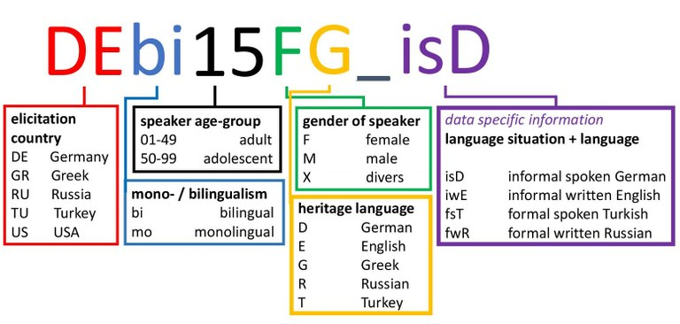
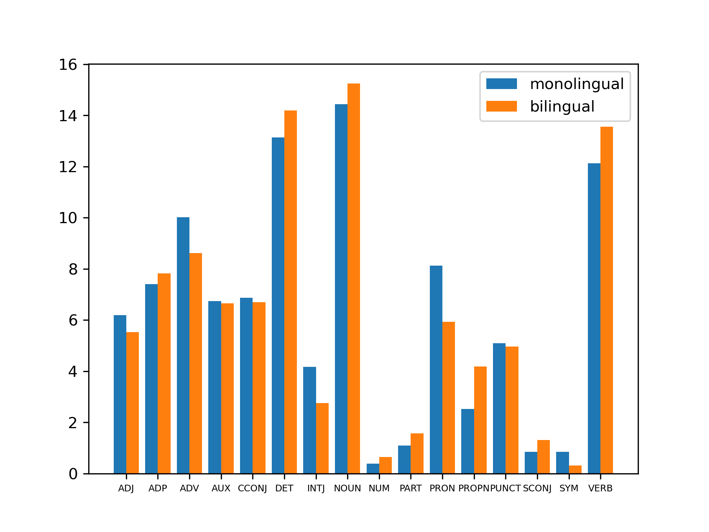
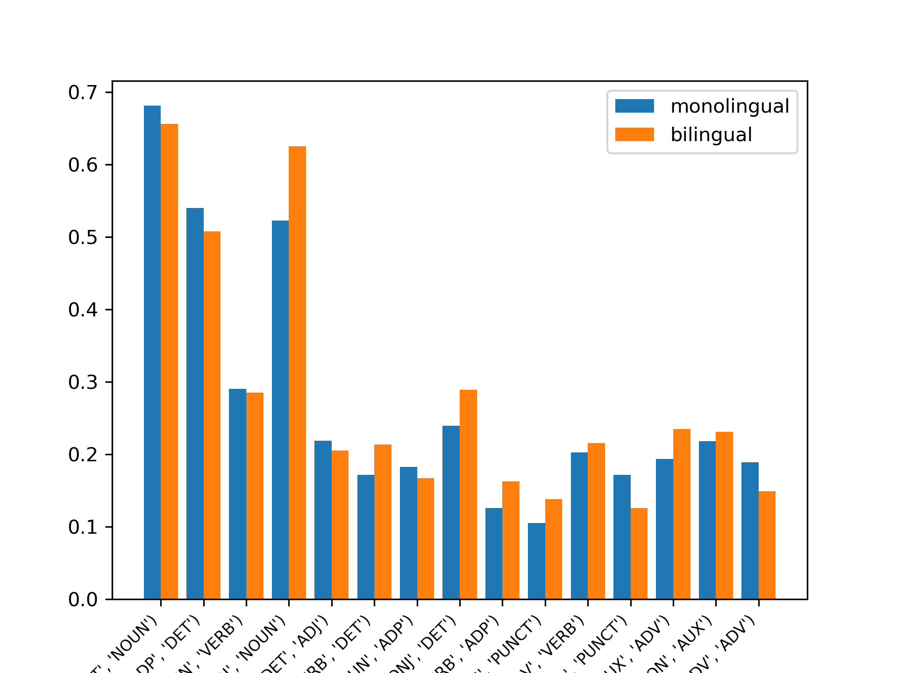
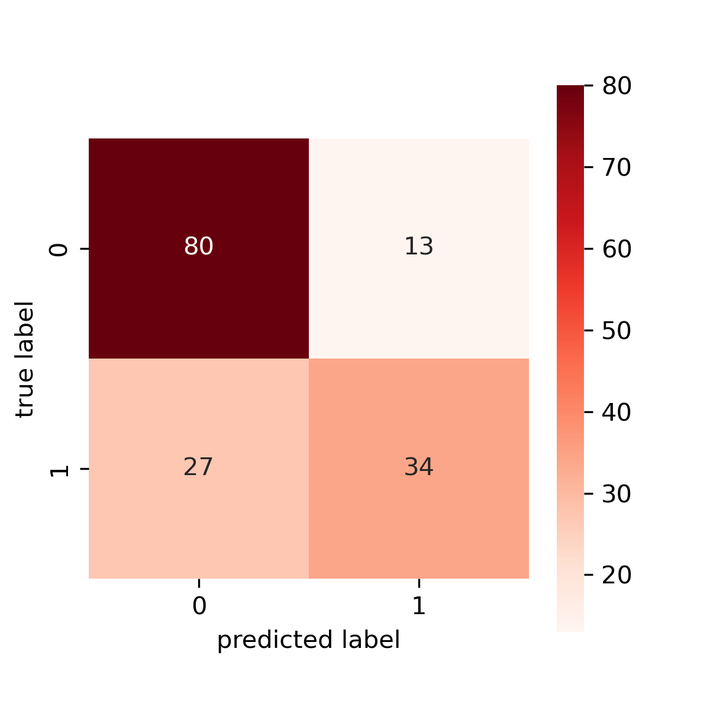
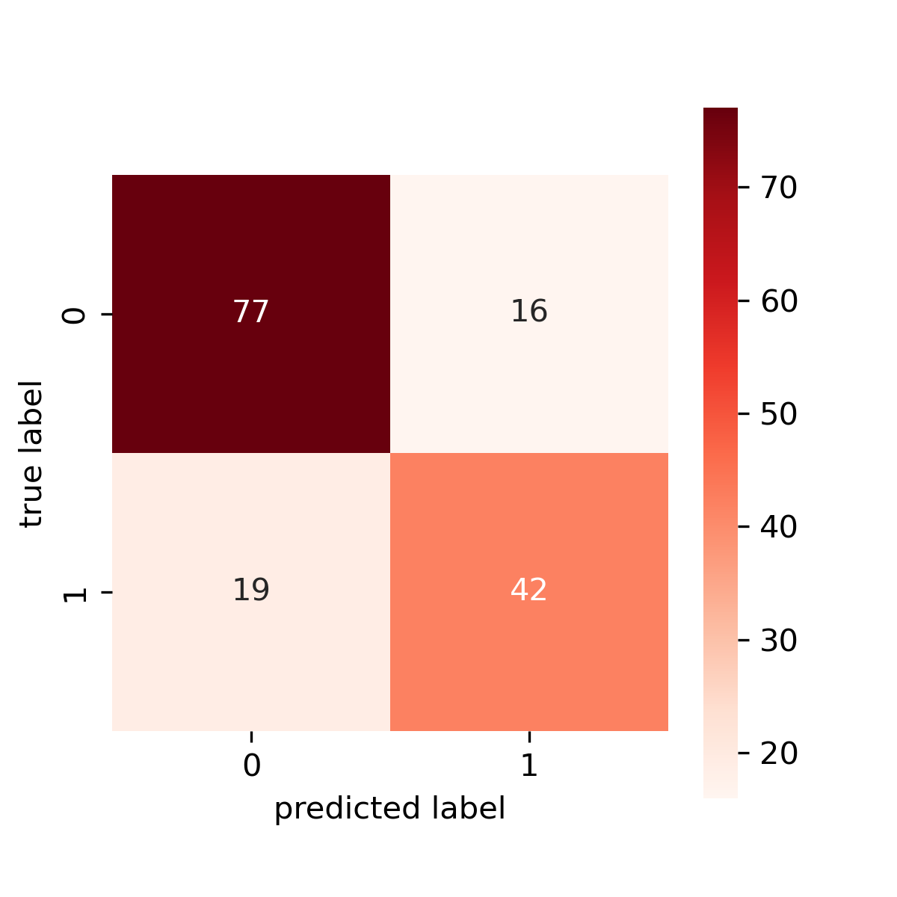
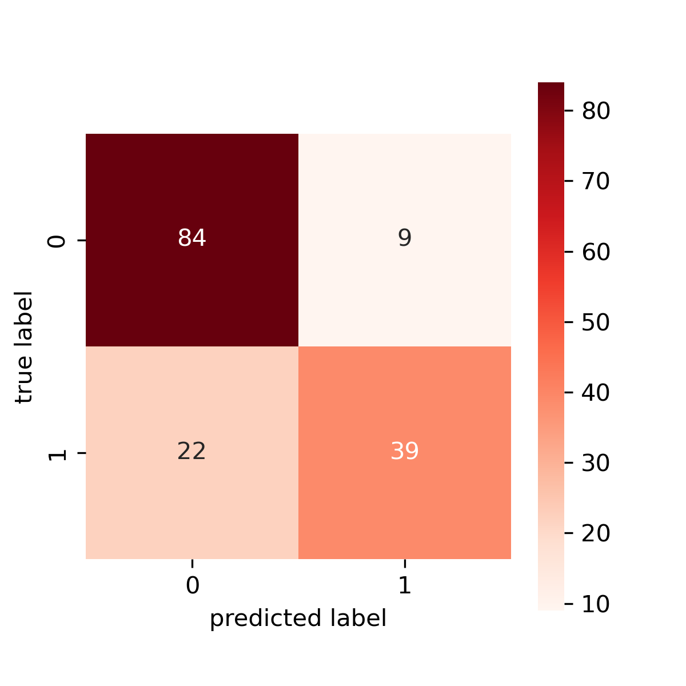

# Final Report
Lillian Carlson
lkc43@pitt.edu
5/1/25

## Overview
There has been tons of research about how monolingual and multilingual speakers have different brain structures or think differently and a lot more from a neurological perspective. While this is fascinating, it begs the question of whether or not this changes the way someone speaks. Perhaps someone who grew up speaking both German and English may incorporate different grammatical constructions that are out of the norm in the spoken language, but normal in the other language they speak. Interestingly, there is not a whole lot of easily findable research on this specific topic, or at least not as much as one would expect.
It's also important to point out that in my research and reports, I use the terms bilingual and multilingual interchangeably. For some of these speakers, bilingual is the correct term, however some of these speakers speak more than two languages.

## Points of Reference
### Personal Guide
In terms of data choices the data was used as is and I did not separate the spoken and written data to evaluate them separately, which may have led to different results. Additionally, these speakers had heritage languages in all five of the original languages as well (Greek, Russian, and Turkish) despite the elications being in only German and English. This means the languages of contact are more varied than just two languages which will lead to a more general exploration of feature differences between multilingual and monolingual speakers. Of course, any feature differences will be partially reliant on the languages of contact. Speakers of different backgrounds make identifiable and consistent mistakes when learning another language, and this idea (if these speakers are **identifiably** monolingual/multilingual) would be transferable to heritage languages. 

It is important to note that not all of these are Indo-European languages, as Turkish is part of the Turkic family and an SOV language. Additionally, Greek has a free word order and pro-drop. The rest are SVO/VSO in certain contexts. These are big differences between languages that may increase the identifiability through the languages' contact and interactions.

My main research questions and goals involved finding if these speakers were identifiable and what features contributed to that identifiability through analyzing the Part of Speech (POS) usage.

## Data
The dataset I used is a well documented dataset called the [RUEG corpus](https://www.linguistik.hu-berlin.de/en/institut-en/professuren-en/rueg/rueg-corpus) which is short for "Research Unit ,Emerging Grammars in Language Contact Sitautions'". It is available through open access. It contains data on speakers from different heritage languages in English, German, Greek, Russian, and Turkish. It has both spoken and written data and the spoken data is transcribed. For the purposes of this research, I used the spoken and written data interchangeably. The data is taken from prompted elicitations as the viewers were given a prompt. In this case the participants were shown a video and were told to elicit a police report for the police or a friend (there is also a distinction in formality in the data). This becomes relevant when looking at the top tokens, because some of them are lexical words that, under normal circumstances and natural elicitations, would not be as popular such as 'Polizei' or 'the ball'.

The version I used for this project was the 0.3.0 version, however a 1.0.0 version is also currently available. The data itself includes a lot including automatically annotated ConLL-U files (the speech transcriptions were done by hand and all files were hand corrected) which were the main focus of my research. There are also audio files from the speech elications and EXMARaLDA files which contained metadata (which I had planned to use to extract metadata, but other methods were far easier and contained the information I needed- see the Methods section below for details).

For my research as I mentioned above, I used the ConLL-U files primarily. I only used the German and English elicitations, because they are the only two languages that I could analyze the tokens of as I understand both languages.

### Academic References
With this being a bigger corpus, I looked at the research other linguists have done with this dataset. There are a few papers that are relevant to my research in terms of analyzing bilingual versus monolingual speakers. The first being an investigation on specific lexical words to explore differences in elaboration between mono/multilingual speakers (Labrenz). This article did find differences in the pragmatics between different speakers, but I am more curious about the syntactic differences and I am mainly looking at the POS usage.
Another article that was more relevant was about pronoun vs proper noun usage which they defined as 'explicitness' (Pashkova). They found that in certain contexts, explicitness was more common in multilingual speakers. This was just one feature that I found more indicative of multilingual speakers in addition to a few other key features.

## Methods
### Metadata Collection
Although there were metadata files, these files had incredibly in depth data that I did not need for my research. Luckily, filenames/speaker IDs were perfectly informative enough for my purposes.

As you can see, each individual ID tag had all the metadata information I needed to conduct my research and I used regular expressions to extract the features I needed and label them accordingly. I then put this metadata into a dataframe for use later down the line.

### Parsing
To parse the ConLL-U files, I used stanza's parsing and created lists of lists dictionaries. Each dictionary was one word with all the syntactic information that was contained in a list (sentence) in a list (full elicitation of an individual speaker) within a list (all files of that type (language and monolingual/multilingual)). From this, I was able to extract lists of tokens and their POS tags.

### Machine Learning
The differences between monolingual and bilingual speakers were not identifiable with the human eye, but that does not mean they are not identifiable at all. My data was not split evenly between languages or linguality. This would be a problem because I did not want language/tokens to be an obvious indicator of mono/multilingualism. To combat this, I used only part of speech. For example, a sentence like "The brown fox jumped hastily" would be fed into the classifier as just "DET ADJ NOUN VERB ADV". Using a simple Naive Bayes classifier (so that I could later do feature extraction), I fed in each sentence as an individual unit with the tag of either monolingual or bilingual.

## Failures
My biggest setback here was the parsing. I tried several methods, and had a lot of failures along the way. I first tried just manually parsing the ConLL-U which gave me a similar result to what stanza provided me with a list of lists of dictionaries. Stanza's format, however, was in a proprietary "Document" format, so although I created the same thing with manual parsing, I was losing all the syntactic dependency relationship information that I may want later.

After trying my hand with manually parsing, I tried the spaCy library for ConLL-U parsing. Overall, I did like this library more as it offered more support and built-in function for the ConLL-U format. Unfortunately, it was a lot pickier with the format of the data being processed. One wrong newline character (among other things) would produce an error and maybe because this was just the 0.3.0 version, or because of some other unidentified error, I could not clean this data enough to get it perfect for spaCy.

This left me with using the stanza library. It was not my preferred library as there were less built-in functions and support for the ConLL-U format, however it worked and provided me exactly what I needed for my project.

## Analysis
I analyzed three levels of POS: unigram, bigram and trigram by hand before moving to machine learning to see if there were any key differences between speech patterns a human can spot. Because I'm analyzing differnt langauges with different grammars, the best way to do this would be to compare the multilingual speakers to their monolingual counterparts. By using the monolingual speakers as a basis for what the language 'should' look like (as in, what the language looks like with less language contact), it would be good to indentify any deviations from the language 'norm' that would be a result from language contact. For most of this analysis, however, the data inside eahc language looked pretty similar, so I ended up lumping the monolingual and bilingual data with little hope, but got some interesting results.

Additionally, it's important to keep in mind through all of this that the sizes of the data are mismatched. There is a lot more bilingual data than monolingual and more German data than English data, meaning that the monolingual English data had 64 total sentences to analyze compared to the German Bilingual which had 586 (the highest amount of the language and lingualism partitions).

#### Unigram
The only thing we can look at for unigram POS is the overall distribution. Although the best thing to do would be to look in the individual languages and compare the mono and bilingual data there, there was not a lot to be made. It looked similar within each language and was difficult to tell apart just by scanning with my eyes.

This is a normalized distribution of the POS usage and the numbers on the side are the percentage of the data they take up. In the bilingual data, we can see more verbs, proper nouns, nouns, and determiners. This is reminiscent of the explicitness I previously mentioned (Pashkova). This is especially shocking to see that lexical categories such as verbs and nouns and proper nouns take up a higher percentage of the data in proportion to the monolingual data because there was more multilingual data which suggest more function words (as is the nature of language, typically longer corpora will proportionally more function words than a shorter corpora).

#### Bigram
The bigram data was a little more interesting, however it ran into the same issue that inside the languages looked pretty identical, so I lumped the bilingual and monolingual data together to investigate. When looking at the most common tokens, there were a shocking amount of lexical words but makes sense when you consider it is prompted speech.

This graph is a little harder to read, but the categories chosen were the top 15 most popular bigrams. The y-axis is the probability of the second word following the first word in the bigram. This makes a clear difference between "adjective, noun" bigrams, suggesting bilingual speakers will follow an adjective with a noun more commonly than a monolingual speaker would. This could suggest monolingual speakers use more strings of adjectives, so an "adjective adjective" bigram would be more popular.

#### Trigram
Trigrams are more difficult to analyze with the human eye because there are so many more factors, so it was harder to get a clear analysis with just the human eye. "Adposition determiner noun" was generally the most common sequence among all the partitions, but that's all that was noticeable with the human eye.

### Machine Learning Analysis
Some was decipherable from analyzing this data with the human eye, but not enough, and nothing concrete. I used the Naive Bayes classifier so I could later perform feature extraction. I did this three times with different results. As mentioned before, I put in the sentences that just contained POS, so no actual word units, just POS markers. I used a tf-idf vectorizer to input the sentences into the classifier. I used all the default modifiers. There were no stopwords because it was just POS units and did not play set max features because I essentially had a 20 word language, and I wanted all unigrams, bigrams, and trigrams to guide the classifier and I knew it couldn't be too many. I did expand the n-gram range for each classifier to see what was most useful without overfitting. The Multinomial Naive Bayes classifier was also set as the default settings.

The baseline is 58.4%. That means if the classifier just guessed every document as bilingual (the majority in the dataset), it would achieve an accuracy of 58.4% and anything above that would suggest there is a genuine difference between bilingual and monolingual speakers.

To test each classifier for chances of overfitting, I also implemented a stratified K-fold test with 5 partitions.

#### Unigram
First, I just did unigrams. Essentially, this just identified the proportions of the different tags in the sentences to determine whether or not it was bilingual or monolingual. This ended up with an accuracy of 74.03%, which is significantly higher than the baseline.

This was shocking, as it was hard to see any clear correlation of POS unigram usage with the human eye. Testing this with the K-fold test, it achieved these accuracy:

[0.7207792207792207,
0.7012987012987013,
0.7792207792207793,
0.7337662337662337,
0.6862745098039216]

Mean Average: 72.43%
STD: 3.19%

These are more spread than would be preferred, with almost a full 10% difference between the highest and lowest scores, but ultimately this still shows a correlation between POS usage and multilingualism.

#### Bigram
The unigram and bigram classifier did better with an initial accuracy of 77.27%, which is a decent improvement from the unigram classifier. Looking at the confusion matrix it performed decently better at identifying the monolingual speakers, but a little worse with the bilingual speakers.

K-fold test
[0.8246753246753247,
0.7467532467532467,
0.7922077922077922,
0.7792207792207793,
0.7712418300653595]

Mean Average: 78.28%
STD: 2.56%

The K-fold test is also a bit more consistent than the unigram classifier, which makes sense as adding bigrams would provide more context and would make the classifier more consistent and less prone to overfitting.

#### Trigram
Adding the trigrams into the classifier, still with bigrams and unigrams, made the classifier's accuracy even higher to nearly 80% (it was 79.87%). Our confusion matrix shows an overall improvement from the strictly unigram classifier, but the addition of trigrams has lowered the accuracy of the monolingual speakers when compared to the bilingual and unigram classifier.

Because of this decrease in monolingual speaker accuracy, I expected more overfitting but the K-fold test shows an even less distribution of accuracies which ultimately suggests this classifier is even less prone to overfitting when provided more context like trigrams.

[0.8051948051948052,
0.7857142857142857,
0.7987012987012987,
0.7792207792207793,
0.7843137254901961]

Mean Average: 79.06%
STD: < 1%

In all of these, the classifier is more prone to misidentifying monolingual as multilingual, which is not too much of a shock as there are more multilingual speakers in the data.

#### Feature Extraction
In all of these, it was still crucial to identify the actual top features. Having numbers and accuracies scores is great, but with linguistic analysis, what I actually care about is **what** the identifiable features are between these groups when it is shown they are present.
Because the Trigram classifier was the most accurate with the lowest standard deviation, I extracted the features from this classifier.
For the features, these are just the features with the highest log probability for both labels, meaning they may not be the most informative compared to its usage in the other label, but they are the top features for each class.

Bilingual: NOUN, DET, VERB, PROPN, DET_NOUN, ADP, CCONJ, AUX, INTJ, ADV, ADJ, VERB_DET, PUNCT, VERB_PROPN, ADP_DET, VERB_DET_NOUN, PROPN_VERB, VERB_ADP, DET_ADJ, ADJ_NOUN
Monolingual: INTJ, NOUN, DET, PRON, ADV, VERB, DET_NOUN, ADP, SYM, ADJ, PROPN, PUNCT, CCONJ, AUX, NOUN_VERB, ADP_DET, ADJ_NOUN, DET_ADJ, ADP_DET_NOUN, ADP_NOUN

As we can see here, a lot of these overlap. I picked out a few of these (mostly ones that had been preestablished by the human eye to be indicative) and found the probability assigned to each feature. The thing to look for with these probabilities is more the **difference** between the numbers. For pronouns, the probabilities for bilingual and monolingual were 0.381% and 0.992% respectively. This is a large difference which shows a stronger correlation with monolingual speakers. In conjunction with the proper noun usage, 1.301% and 0.715% respectively, it shows the correlation of explicitness in bilingual speakers of monolingual speakers. Bigram usage of "determiner noun" being 1.137% and 0.942% only strengthens this argument.

In terms of the adjective and adverb usage also noted above, the adjective probability turned out to be nearly identical, so not quite as informative as expected. The adverb probabilities were 0.766% and 0.990% which does show some difference and a greater use of adverb usage in monolingual speakers compared to bilingual speakers.

Additionally, adpositions showed to be another key difference with the probabilities being 1.116% and 0.878% showing a stronger usage of adpositions in bilingual speakers.

These are all small percentages, but in a sentence, these small percentages add up and come together to show a difference in the way bilingual and monolinguals speak that may not be perceptible to the human eye or ear but show a clear language interaction within bilingual speakers.

## Conclusion 
Overall, the language interactions inside a bilingual speaker are realized in their speech and make them distinguishable compared to a monolingual speaker. Particularly in this context, there is a greater level of explicitness in bilingual speakers compared to monolingual speakers. By just analyzing part of speech patterns, there is a discoverable difference between monolingual and bilingual speakers.

There are likely other differences as well that are yet to be explored, particularly word usage in relation to dependency relations rather than part of speech usage, that I think deserved to be explored more. I am currently working on looking at dependency relations as I've been contacting more qualified and knowledgeable people than me on this subject. They're a bit more complicated than part of speech usage, so I want to ensure I approach it correctly.

## Citations
Labrenz, A. (2023). Functional Variation of German Also across Registers and Speaker Groups. Contrastive Pragmatics, 4(2), 289-320. https://doi.org/10.1163/26660393-bja10077
Pashkova, T., & Allen, S. (2025). Explicitness of referring expressions in heritage speakers’ majority English. Lingua, Volume 314(103854). https://doi.org/10.1016/j.lingua.2024.103854.